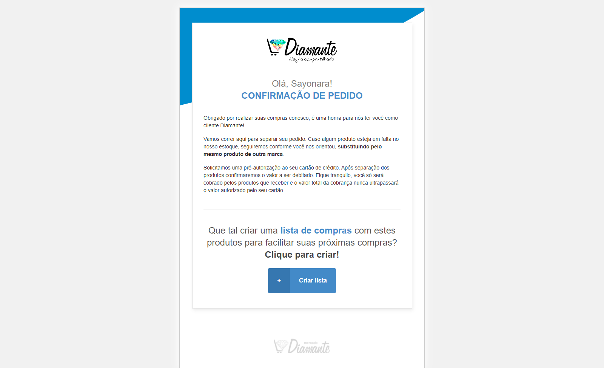

# <p align="center">Email com Código 📧⚙️ </p>


---
## <p align="center">Acesso Rápido:</p>
<p align="center">
https://gabiqrm.github.io/EmailcomCodigo/
</p>


---
<p align="center">
   
</p>

<div align="center">

[](https://github.com/gabiqrm/EmailcomCodigo)<space> <space>[](https://github.com/gabiqrm/EmailcomCodigo/blob/master/LICENSE)<space> <space>[](https://github.com/gabiqrm/EmailcomCodigo/)

</div>

---
## 📋 Sobre:

Site criado a partir de um desafio proposto pela empresa Marlin, cujo o objetivo é  gerar o código necessário de tabelas para que seja possível editar os textos. Muito utilizado para e-mails transacionais que precisamos exibir dados dinâmicos no meio das mensagens.

---
## ⚙️ Tecnologias:

```bash
📍 HTML5
📍 CSS3
```

---
##  Execução:
1. Clonar via prompt de comando o projeto em uma pasta de sua preferência:
```bash
$ git clone https://github.com/gabiqrm/EmailcomCodigo.git
```
2. Acessar a pasta principal do projeto via prompt de comando:
```bash
$ cd EmailcomCodigo
```
3. Na pasta raiz, executar o arquivo: `index.html`

---
## 🔐 Licença:
Esse projeto está sob a licença MIT. Veja o arquivo [LICENSE](LICENSE) para mais detalhes.

---

## 👩🏻‍💻 Desenvolvedora:

Desenvolvido por Gabriela Queiroz ! 💜
